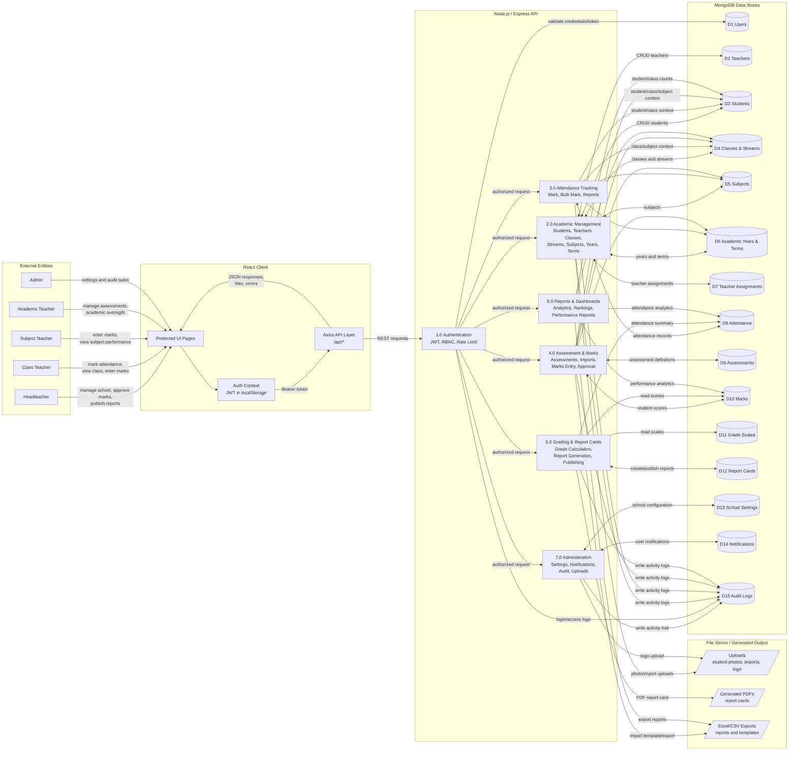

# School Attendance Tracking & Grading Management System Diagrams

Generated from the Express routes and Mongoose schemas in `server/src`.

## Data Flow Diagram



## Entity Relationship Diagram

```mermaid
erDiagram
  SCHOOL_SETTING {
    ObjectId _id PK
    string schoolName
    string schoolCode UK
    object address
    string phone
    string email
    string website
    string logo
    string motto
    string principalName
    string gradingSystem
    object academicYearConfig
    object reportCardConfig
    number sessionTimeout
    string theme
    string timezone
    string locale
  }

  USER {
    ObjectId _id PK
    string email UK
    string password
    string role
    string firstName
    string lastName
    string phone
    boolean isActive
    date lastLogin
    date passwordChangedAt
    ObjectId schoolId FK
  }

  TEACHER {
    ObjectId _id PK
    ObjectId user FK
    string employeeId UK
    string firstName
    string lastName
    string gender
    date dateOfBirth
    array qualifications
    array subjects FK
    ObjectId classAssigned FK
    string designation
    object emergencyContact
    object address
    array documents
  }

  STUDENT {
    ObjectId _id PK
    ObjectId user FK
    string admissionNumber UK
    string firstName
    string lastName
    string gender
    date dateOfBirth
    ObjectId class FK
    ObjectId stream FK
    object guardianInfo
    string address
    string emergencyContact
    string medicalInfo
    string passportPhoto
    date enrollmentDate
    string status
    array academicHistory
    string previousSchool
    object schoolFees
  }

  ACADEMIC_YEAR {
    ObjectId _id PK
    string name
    string year
    date startDate
    date endDate
    boolean isCurrent
    array terms FK
  }

  TERM {
    ObjectId _id PK
    string name
    ObjectId academicYear FK
    date startDate
    date endDate
    boolean isCurrent
    array examCategories FK
  }

  CLASS {
    ObjectId _id PK
    string name
    string code UK
    string description
    string department
    ObjectId academicYear FK
    ObjectId classTeacher FK
    number capacity
    array streams FK
    array subjects FK
  }

  STREAM {
    ObjectId _id PK
    string name
    string code UK
    ObjectId class FK
    string description
  }

  SUBJECT {
    ObjectId _id PK
    string name
    string code UK
    string description
    string department
    string category
    number credits
  }

  TEACHER_ASSIGNMENT {
    ObjectId _id PK
    ObjectId teacher FK
    ObjectId class FK
    ObjectId subject FK
    ObjectId stream FK
    ObjectId academicYear FK
    ObjectId term FK
    string teacherRole
    boolean isClassTeacher
    ObjectId assignedBy FK
  }

  ATTENDANCE {
    ObjectId _id PK
    ObjectId student FK
    ObjectId teacher FK
    ObjectId class FK
    ObjectId subject FK
    date date
    date timeIn
    date timeOut
    string status
    string remarks
    string deviceUsed
    object location
    ObjectId academicYear FK
    ObjectId term FK
    ObjectId markedBy FK
  }

  ASSESSMENT {
    ObjectId _id PK
    string name
    string code UK
    string type
    number weight
    ObjectId academicYear FK
    ObjectId term FK
    ObjectId subject FK
    ObjectId class FK
    ObjectId stream FK
    number maxScore
    date examDate
    number duration
    string instructions
    ObjectId createdBy FK
    string status
    date releaseDate
    boolean isRequired
  }

  MARK {
    ObjectId _id PK
    ObjectId student FK
    ObjectId assessment FK
    ObjectId subject FK
    ObjectId class FK
    ObjectId stream FK
    ObjectId academicYear FK
    ObjectId term FK
    number score
    number totalScore
    string grade
    number gradePoint
    string remarks
    ObjectId gradedBy FK
    boolean isApproved
    ObjectId approvedBy FK
    date approvedAt
    boolean isMissing
    date submittedAt
  }

  GRADE_SCALE {
    ObjectId _id PK
    string name
    string code
    number minScore
    number maxScore
    number gradePoint
    string description
    string remark
    string system
    boolean isActive
  }

  REPORT_CARD {
    ObjectId _id PK
    ObjectId student FK
    ObjectId academicYear FK
    ObjectId term FK
    ObjectId class FK
    ObjectId stream FK
    array subjects FK
    number totalScore
    number averageScore
    string grade
    number gradePoint
    number position
    number classSize
    object attendanceSummary
    string teacherRemarks
    string headteacherRemarks
    ObjectId generatedBy FK
    date generatedAt
    boolean isPublished
    string qrCode
    string templateVersion
  }

  NOTIFICATION {
    ObjectId _id PK
    ObjectId recipient FK
    string type
    string title
    string message
    boolean isRead
    string link
    ObjectId sentBy FK
    date createdAt
  }

  AUDIT_LOG {
    ObjectId _id PK
    ObjectId user FK
    string action
    string resource
    string resourceId
    mixed details
    string ipAddress
    string userAgent
    date timestamp
  }

  SCHOOL_SETTING ||--o{ USER : schoolId
  USER ||--o| TEACHER : teacher_profile
  USER ||--o| STUDENT : student_profile
  USER ||--o{ TEACHER_ASSIGNMENT : assignedBy
  USER ||--o{ ASSESSMENT : createdBy
  USER ||--o{ MARK : grades_or_approves
  USER ||--o{ ATTENDANCE : markedBy
  USER ||--o{ REPORT_CARD : generatedBy
  USER ||--o{ NOTIFICATION : receives
  USER ||--o{ NOTIFICATION : sends
  USER ||--o{ AUDIT_LOG : performs

  ACADEMIC_YEAR ||--o{ TERM : contains
  ACADEMIC_YEAR ||--o{ CLASS : organizes
  ACADEMIC_YEAR ||--o{ TEACHER_ASSIGNMENT : scopes
  ACADEMIC_YEAR ||--o{ ATTENDANCE : scopes
  ACADEMIC_YEAR ||--o{ ASSESSMENT : scopes
  ACADEMIC_YEAR ||--o{ MARK : scopes
  ACADEMIC_YEAR ||--o{ REPORT_CARD : scopes

  TERM ||--o{ TEACHER_ASSIGNMENT : scopes
  TERM ||--o{ ATTENDANCE : scopes
  TERM ||--o{ ASSESSMENT : contains
  TERM ||--o{ MARK : scopes
  TERM ||--o{ REPORT_CARD : scopes

  TEACHER ||--o{ CLASS : classTeacher
  TEACHER ||--o{ TEACHER_ASSIGNMENT : receives
  TEACHER }o--o{ SUBJECT : subject_list
  TEACHER ||--o{ ATTENDANCE : records

  CLASS ||--o{ STREAM : has
  CLASS ||--o{ STUDENT : enrolls
  CLASS }o--o{ SUBJECT : offers
  CLASS ||--o{ TEACHER_ASSIGNMENT : assigned_in
  CLASS ||--o{ ATTENDANCE : attendance_for
  CLASS ||--o{ ASSESSMENT : assessment_for
  CLASS ||--o{ MARK : marks_for
  CLASS ||--o{ REPORT_CARD : reports_for

  STREAM ||--o{ STUDENT : groups
  STREAM ||--o{ TEACHER_ASSIGNMENT : assigned_in
  STREAM ||--o{ ATTENDANCE : attendance_for
  STREAM ||--o{ ASSESSMENT : assessment_for
  STREAM ||--o{ MARK : marks_for
  STREAM ||--o{ REPORT_CARD : reports_for

  SUBJECT ||--o{ TEACHER_ASSIGNMENT : assigned
  SUBJECT ||--o{ ATTENDANCE : attendance_for
  SUBJECT ||--o{ ASSESSMENT : tested_by
  SUBJECT ||--o{ MARK : marks_for
  SUBJECT }o--o{ REPORT_CARD : subject_results

  STUDENT ||--o{ ATTENDANCE : has
  STUDENT ||--o{ MARK : receives
  STUDENT ||--o{ REPORT_CARD : has

  ASSESSMENT ||--o{ MARK : has
  GRADE_SCALE ||..o{ MARK : used_to_calculate
  MARK }o..o{ REPORT_CARD : summarized_into
```

## Key Notes

- MongoDB stores these as Mongoose documents with `ObjectId` references and embedded objects/arrays, not SQL foreign keys.
- Compound unique indexes exist for `TeacherAssignment(teacher, class, subject)`, `Mark(student, assessment)`, and `ReportCard(student, academicYear, term)`.
- `ReportCard.subjects`, `ReportCard.attendanceSummary`, `Student.guardianInfo`, `Student.academicHistory`, `Teacher.qualifications`, and several settings fields are embedded structures.
- `GradeScale` is not referenced by `Mark`; it is used by the grading engine to derive `grade` and `gradePoint`.
